# Learnify AWS Deployment Documentation

Learnify is a full-stack e-learning and video-conferencing platform. This document records the AWS infrastructure and deployment workflow.

## Deployment Architecture

- **Frontend:** React.js deployed with AWS Amplify
- **Backend:** Node.js and Express.js hosted on Amazon EC2
- **Database:** MongoDB Atlas
- **Networking:** Elastic IP and EC2 security groups
- **Monitoring:** Amazon CloudWatch
- **Storage:** Amazon EBS
- **Version control:** Git and GitHub

## AWS Deployment Screenshots

### 1. EC2 instance launch

Successfully initiated the launch of the Learnify backend EC2 instance.

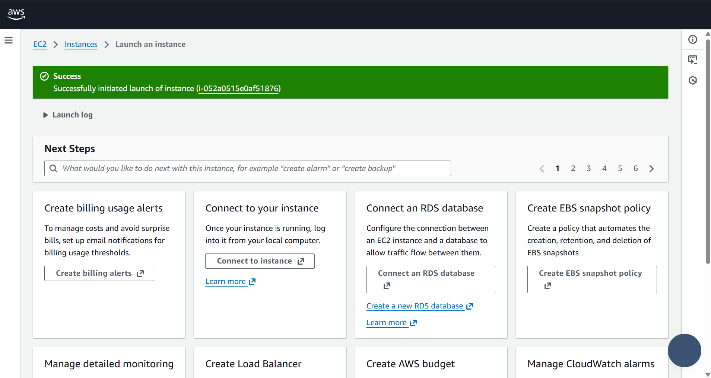

### 2. Elastic IP allocation

Allocated an Elastic IP address for stable public addressing.

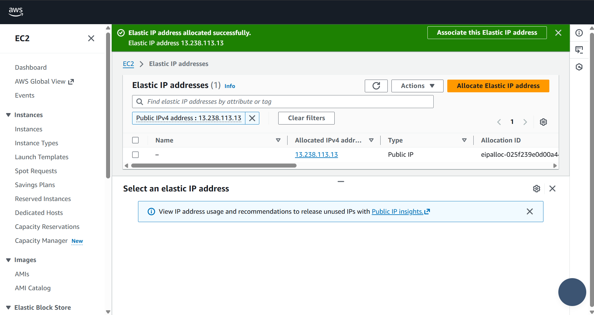

### 3. Elastic IP association

Associated the Elastic IP with the backend EC2 instance.

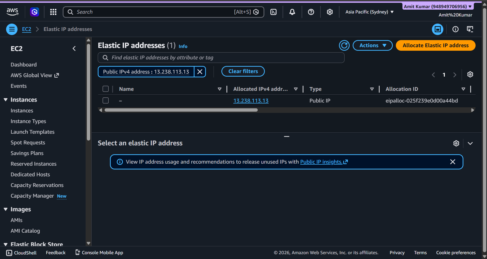

### 4. Security group inbound rules

Reviewed inbound HTTP, HTTPS, and SSH rules. Keep production rules as restrictive as possible.

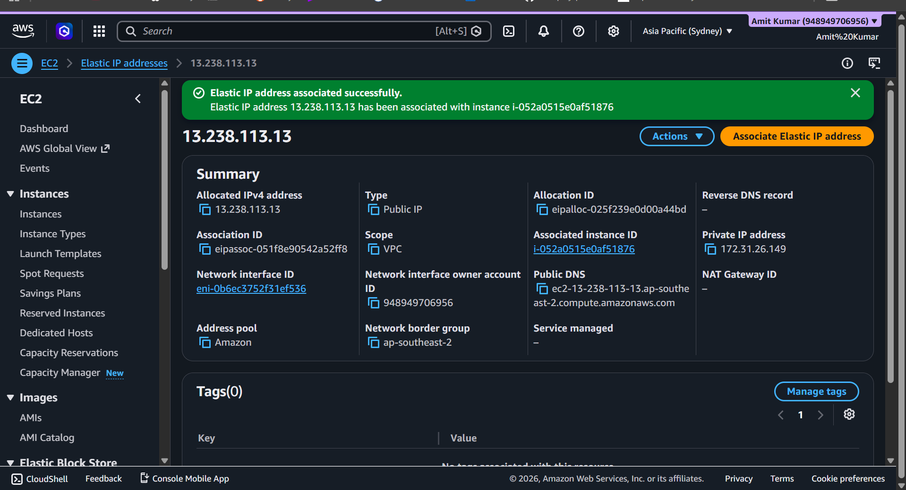

### 5. Backend process and database connection

Started the Node.js backend and verified the MongoDB connection.

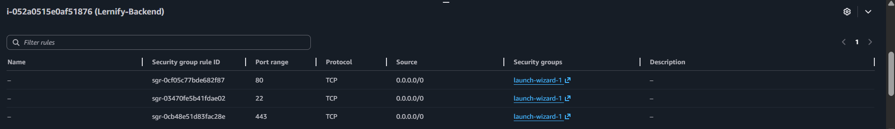

### 6. EC2 instance status

Verified that the instance was running and status checks had passed.

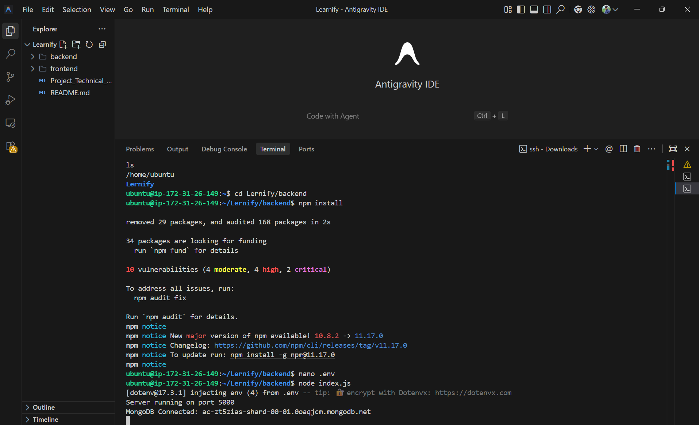

### 7. CloudWatch monitoring

Reviewed CPU utilization and network metrics.

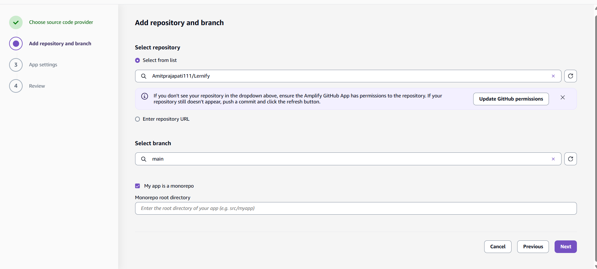

### 8. EBS storage volume

Reviewed the attached Elastic Block Store volume.

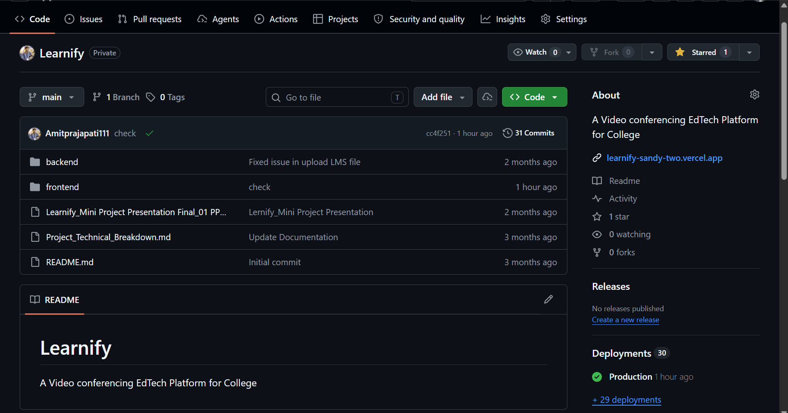

### 9. EC2 key pair

Documented the key-pair configuration. Never upload the private .pem key.

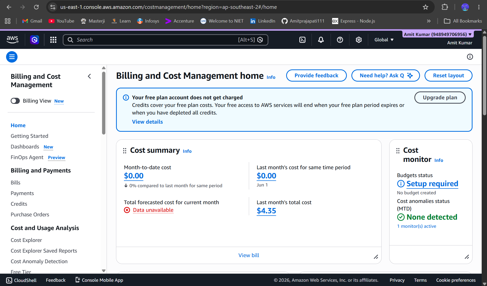

### 10. Security groups

Reviewed the available EC2 security groups.

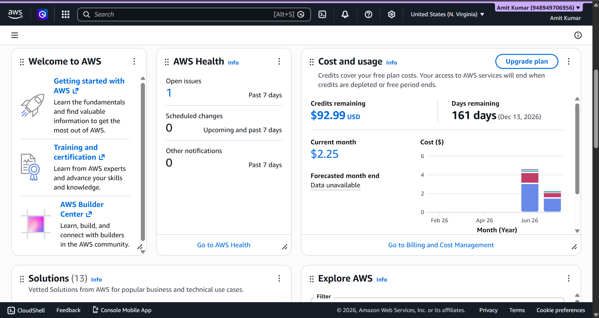

### 11. Amplify repository setup

Selected the GitHub repository and production branch for the frontend.

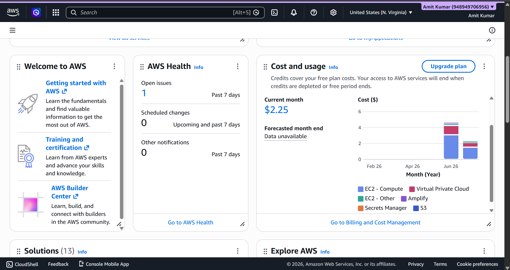

### 12. Amplify deployment history

Reviewed the frontend build and deployment status.

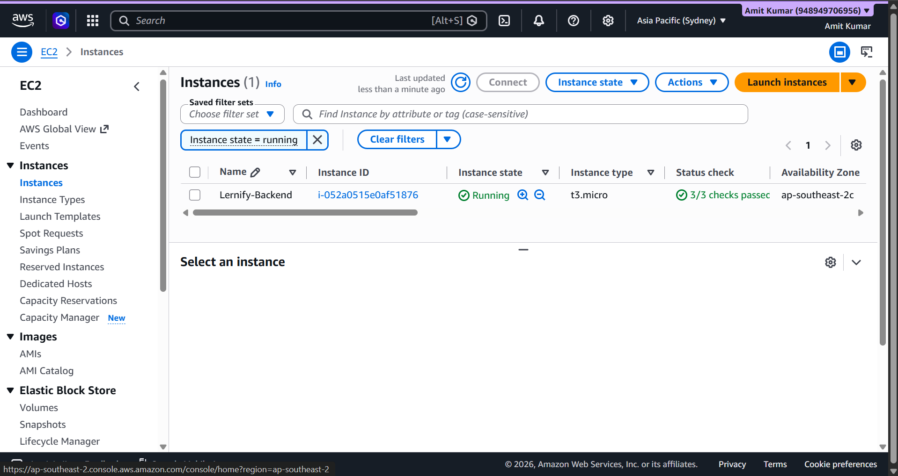

### 13. Amplify app settings

Reviewed the Amplify application and production branch settings.

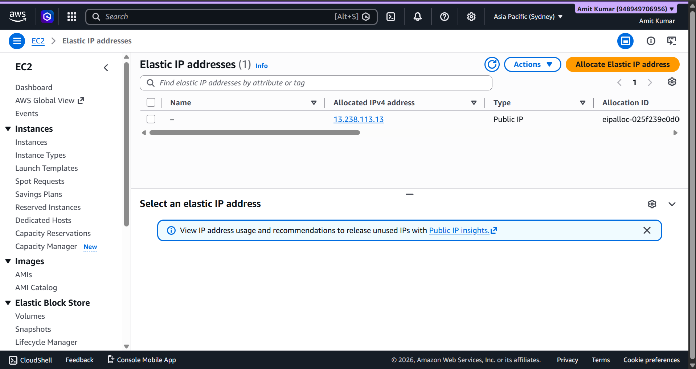

### 14. AWS billing overview

Reviewed AWS billing and cost information.

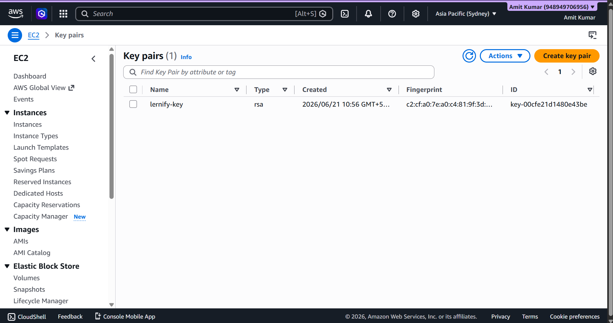

### 15. AWS dashboard and credits

Reviewed account-level usage and credit information.

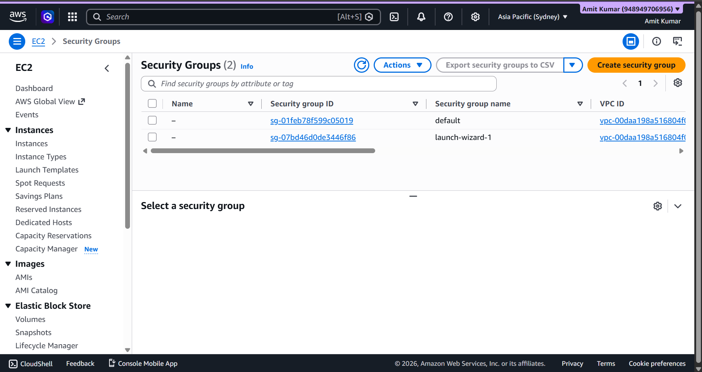

### 16. Elastic IP details

Recorded the Elastic IP configuration details.

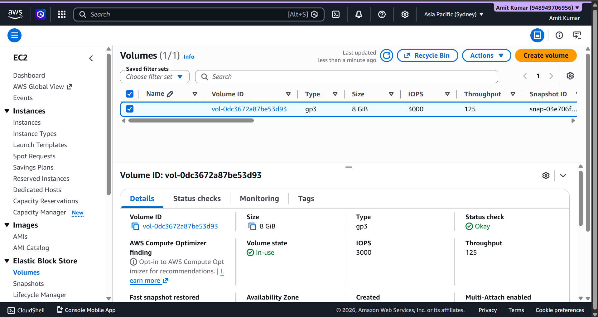

### 17. GitHub repository

Shows the project repository and source-code structure.

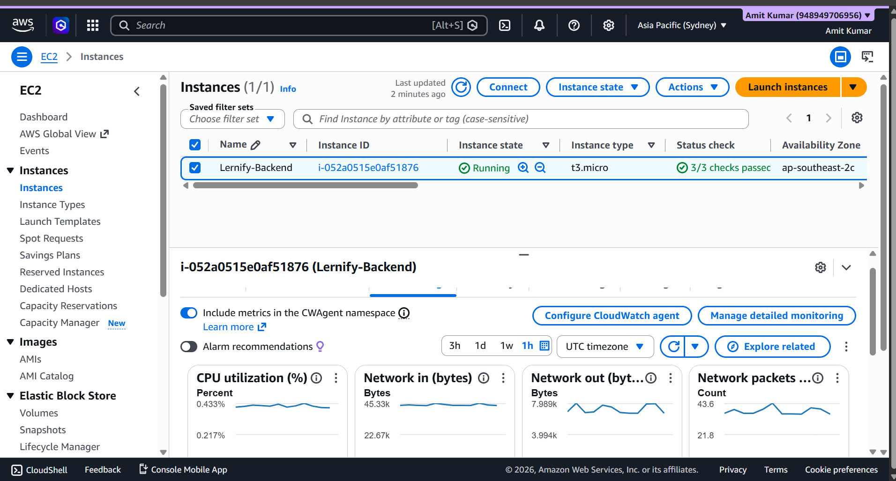

### 18. Amplify build/deploy details

Shows build and deployment information.

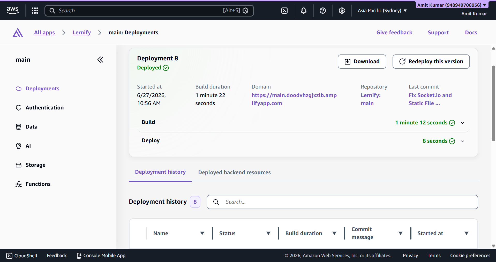

### 19. Additional EC2 configuration

Additional infrastructure configuration evidence.

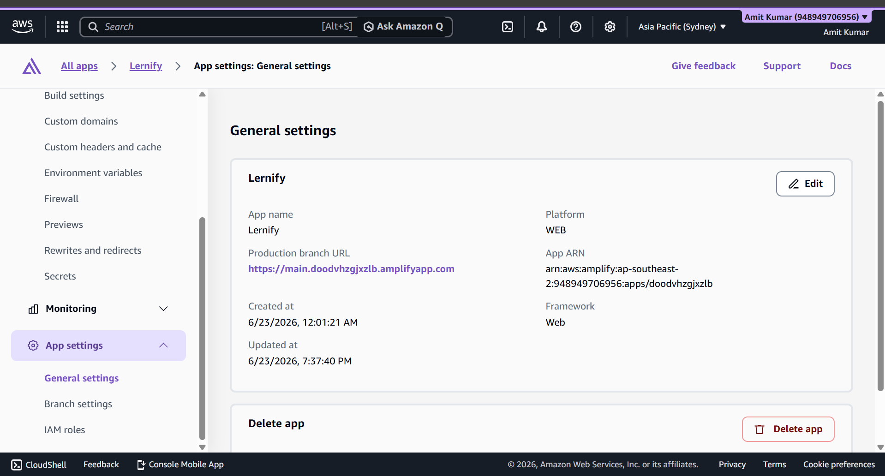

## Deployment Summary

- Hosted the Node.js/Express backend on Amazon EC2.
- Connected the backend to MongoDB Atlas.
- Configured an Elastic IP and EC2 security groups.
- Deployed the React frontend using AWS Amplify.
- Reviewed instance monitoring, storage, and AWS cost information.

## Technology Stack

React.js · Node.js · Express.js · MongoDB Atlas · Amazon EC2 · AWS Amplify · Elastic IP · EBS · CloudWatch · GitHub

## Repository

https://github.com/Amitprajapati111/Lernify

---

**Security note:** Before publishing screenshots in a public repository, redact AWS account IDs, private or sensitive identifiers, and any credentials. Never upload `.env` files, passwords, access keys, or private SSH keys.
